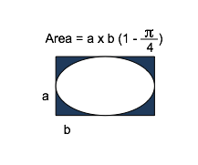
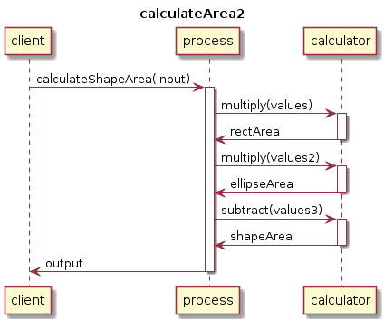

# T2 - Orquestração de serviços

Engine utilizada: [Chorusjs](http://chorusjs.com)

## O que é Chorus.js?

A engine Chorus.js oferece uma maneira muito simples para orquestrar APIs síncronas e assíncronas em aplicações Node.

Chorus.js permite criar serviços simples (ou stub serviços mais complexos) usando uma  API / Service Definition Language. Um dos objetivos do projeto do núcleo de Chorus.js é lidar de forma eficaz com versionamento, o que é um problema muito difícil de quebrar em sistemas distribuídos e que não foi tratado com eficácia até agora. Assim, uma API (ou Service) é um conjunto de versões, cada versão pode ter uma interface diferente. A unidade de reutilização do nosso SDL é a operação, não a interface como em WSDL. Cada operação tem um conjunto de mensagens (entrada, saída e falhas), cada mensagem é composta de peças que têm um tipo (por exemplo, uma definição de entidade). Entidades próprios podem ser atualizados e referenciados como tal a partir das definições de mensagens.

As definições do processo exemplo podem ser vistos na pasta **definitions**.

## Descrição do serviço exemplo: Calculations

**A definição do processo (BPEL) pode ser vista aqui:** [calculateArea BPEL](definitions/calculateArea2_v1.bpel)

**A definição do processo (cord) pode ser vista aqui:** [calculateArea cord definition](definitions/calculateArea2.cord)

**A definição do serviço computation (cauladora) pode ser vista aqui:** [computation definition](definitions/computation.cord)

**Outline:**

* Uma definição do processo declara os serviços e variáveis usados
* Sua atividade raiz é, neste caso, uma sequência (de atividades)
* A sequência é executada como:
	* espera para receber uma requisição
	* atribuição dos valores de entrada, e invocação dos seguintes processos: 
		* Cálculo da área do retângulo (`calculateRectArea`)
			* Chamada do serviço `calculator.multiply` com `input do client`
		* Cálculo da área da elipse (`calculateElipseArea`)
			* Chamada do serviço `calculator.multiply` com  `input do serviço anterior` e `0.7853975`
		* Subtração das áreas (`subractAreas`)
			* Chamada do serviço `calculator.subtract` com  `rectArea` e `ellipseArea`
	* Atribuição da resposta (do último serviço) para a resposta da orquestração
	* retorna a resposta

**A fórmula do cálculo é:**

**Este é o diagrama de sequência do processo:**

## Executando o servidor

Primeiro, instale o [node.js](https://nodejs.org/en/) e [mongodb](https://www.mongodb.org/).

Agora, navegue até a raiz do repositório (t2) e instale os pacotes necessários:

	npm install

Para executar o servidor, no terminal, execute:

	node calculateArea2_v1.js

Você verá a seguinte saída:

	[2016-03-03 15:38:58.923] [WARN] [default] - ------------ Process Endpoints ---------------
	[2016-03-03 15:38:58.927] [WARN] [default] - [ENDPOINT] calculateArea2_calculateShapeArea_receive
	[2016-03-03 15:38:58.929] [WARN] [default] - [ENDPOINT] calculateArea2_calculateRectArea_invoke
	[2016-03-03 15:38:58.931] [WARN] [default] - [ENDPOINT] calculateArea2_calculateElipseArea_invoke
	[2016-03-03 15:38:58.931] [WARN] [default] - [ENDPOINT] calculateArea2_subractAreas_invoke
	[2016-03-03 15:38:58.932] [WARN] [default] -
	------------ Admin Console -------------------
	[2016-03-03 15:38:58.933] [WARN] [default] - [ENDPOINT] /chorus/calculateArea2/util/instances
	[2016-03-03 15:38:58.934] [WARN] [default] -
	------------ Server started ------------------
	[2016-03-03 15:38:58.939] [WARN] [default] - [SERVER] listening on port 3000

O log do processo, com os serviços chamados e a saída podem ser acompanhados aqui.

## Executando o cliente

No terminal, execute:

	curl -H "Content-Type: application/json" -d '{ "input" : { "a" : "5" , "b" : "20" }}' http://localhost:3000/calculateArea2/v1/receive/calculateShapeArea

O comando anterior enviará um request para o endpoint `calculateShapeArea` do processo `calculateArea2` com a altura e largura (a e b). O retorno do processo será exibido em seguida.

	{ "process": "calculateArea2", "reply" : { "output" : {"res":"21.460250000000002"}}}

O log do processo pode ser visto aqui: [log de execução calculateArea2](logs/calculateArea2.log)